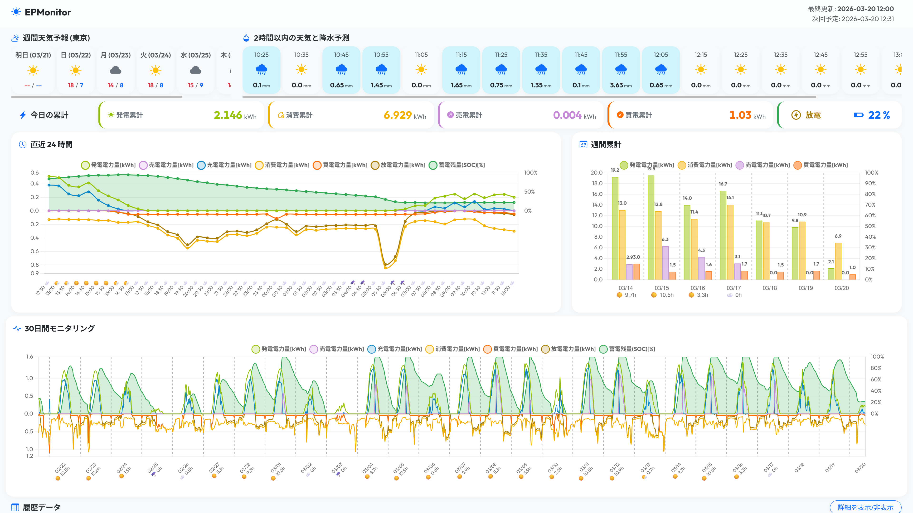
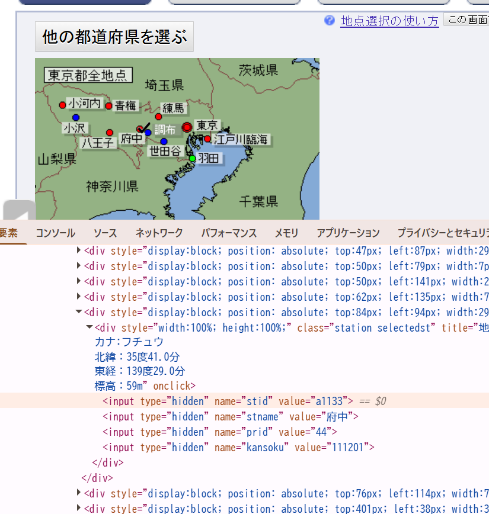
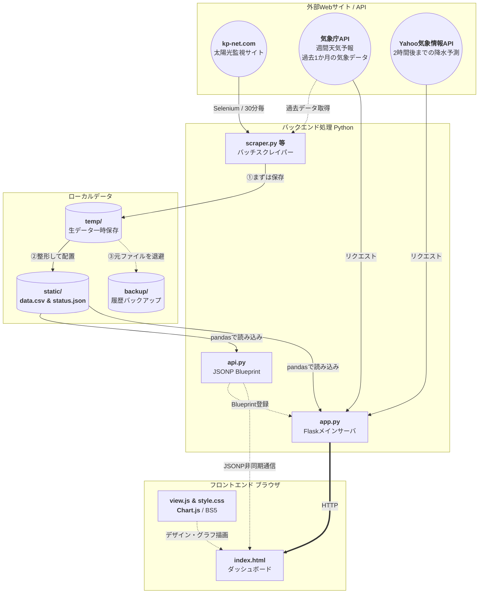

# EPLogger - 太陽光発電モニタリングダッシュボード

オムロンの遠隔モニタリングサービス「KP-Net」から太陽光発電システムの電力データを自動取得し、可視化するWebダッシュボードです。

## 主な機能

- **データ収集:** SeleniumでKP-Netにログインし、CSVデータを自動ダウンロード・マージ（30分間隔でcronを設定すること）
- **リアルタイム可視化:** Chart.js による直近24時間・全期間・週間累計のインタラクティブな電力グラフ（30分単位で自動リロード）
- **蓄電池モニタリング:** 充電/放電ステータスとSOC（残量%）を表示
- **気象情報連携:** 気象庁API（週間天気予報）、Yahoo!天気API（2時間降水予測）を統合表示


(イメージはPC版。レスポンシブ対応でモバイルアクセスでも閲覧可能。)

## プロジェクト構成

```
EPLogger/
├── scraper.py           # データ取得バッチ（Selenium + CSVマージ）
├── app.py               # Flaskダッシュボードサーバ
├── api.py               # JSONP形式でグラフデータを提供するBlueprint
├── get_past_weather.py  # 気象庁の過去気象データ取得スクリプト
├── .env                 # 環境変数（認証情報・APIキー）
├── .gitignore
├── templates/
│   └── index.html       # ダッシュボードHTMLテンプレート
├── static/
│   ├── view.js          # Chart.js グラフ描画スクリプト
│   ├── style.css        # カスタムCSS
│   ├── data.csv         # 電力データ（動的生成）
│   └── past_weather.csv # 過去気象データ（動的生成）
├── temp/                # ダウンロード一時ファイル
└── backup/              # バックアップファイル
```

## セットアップ方法

### 前提条件

- Python 3.10+
- Google Chrome（Seleniumで使用）

### 1. リポジトリのクローンと仮想環境の構築

```bash
git clone <リポジトリURL>
cd EPLogger
python -m venv .
# Scripts\activate      # Windowsで実施
# source bin/activate  # Linux/Macで実施
```

### 2. 依存パッケージのインストール

```bash
pip install flask pandas selenium webdriver-manager python-dotenv requests
```

### 3. 環境変数の設定

`.env` ファイルをプロジェクトルートに作成し、以下の変数を設定してください：
> ⚠️ `.env` は `.gitignore` に含まれており、Gitにはコミットされません

```env
LOGIN_ID=<監視サイトのログインID>
LOGIN_PASSWORD=<監視サイトのパスワード>
COORDINATES=<経度,緯度>          # Yahoo天気API用（例: 139.76719,35.68136）
APP_ID=<Yahoo APIアプリケーションID>
JMA_AREA_CODE0=<都道府県コード>  # 気象庁 週間予報API用（例: 130000=東京都）
JMA_AREA_CODE1=<天気エリアコード> # 気象庁 天気情報エリア（例: 130010=東京地方(本州)）
JMA_AREA_CODE2=<気温エリアコード> # 気象庁 気温情報エリア（例: 44132=東京）
JMA_STATION_NUM=<観測所番号>     # 気象庁 過去の気象データ用（例: a1133=府中）
```

1. `JMA_AREA_CODE0` は 都道府県番号2桁+0000
2. `JMA_AREA_CODE1` は `https://www.jma.go.jp/bosai/forecast/data/forecast/{JMA_AREA_CODE0}.json` にアクセスして `[0].timeSeries[0].areas` を見ると、その地域の観測所が見つかります。  
    たとえば東京だと

    ```json
    [
    {
        "publishingOffice": "気象庁",
        "reportDatetime": "2026-02-28T17:00:00+09:00",
        "timeSeries": [
        {
            "areas": 
            "areas": [
                {
                "area": {
                    "name": "東京地方",
                    "code": "130010"
                },
                //省略
                },
                {
                "area": {
                    "name": "伊豆諸島北部",
                    "code": "130020"
                },
                //省略
                },
                {
                "area": {
                    "name": "伊豆諸島南部",
                    "code": "130030"
                },
                //省略
                },
                {
                "area": {
                    "name": "小笠原諸島",
                    "code": "130040"
                },
                //省略
                }
    ```

    の4か所があるので、その中から最も近い地域の `code` を設定します。
3. `JMA_AREA_CODE2` は 最末尾の `precipAverage` をみると

    ```json
        "precipAverage": {
        "areas": [
            {
            "area": {
                "name": "東京",
                "code": "44132"
            },
            // 省略
            },
            {
            "area": {
                "name": "大島",
                "code": "44172"
            },
            // 省略
            },
            {
            "area": {
                "name": "八丈島",
                "code": "44263"
            },
            // 省略
            },
            {
            "area": {
                "name": "父島",
                "code": "44301"
            },
            // 省略
            }
        ]
        }
    ```

    のようにすんなりわかるので、対応する `code` を設定します。
4. `JMA_STATION_NUM` は少し複雑です。  
    1. 気象庁の「[過去の気象データ・ダウンロード](https://www.data.jma.go.jp/risk/obsdl/index.php)」ページに行きます。
    2. 「地点を選ぶ」で対象の都道府県をクリック
    3. 対象の観測所を**右クリック**して、「検証」
    4. 一個下の要素のhidden項目の中の、`stid` の値が `JMA_STATION_NUM` になります。
    

## 使い方

### データ取得（手動実行）

```bash
# 当月のデータを取得
python scraper.py

# 特定月のデータを取得
python scraper.py 2026-02
```

### ダッシュボードの起動

```bash
python app.py
```

ブラウザで `http://localhost:5000/` にアクセスしてダッシュボードを確認できます。
LAN内の他端末からは `http://<サーバーのIPアドレス>:5000/` でアクセス可能です。

### 定期実行（推奨）

`scraper.py` を **30分おき** に自動実行することで、常に最新の電力データを保持できます。
また、`get_past_weather.py` を **1日1回（0時推奨）** 実行して、日々の過去気象データを自動取得することを推奨します。

#### Linux / Mac（crontab）

```bash
# crontab を編集
crontab -e

# 以下の行を追加（30分おきに scraper.py を実行）
*/30 * * * * cd /path/to/EPLogger && /path/to/EPLogger/bin/python scraper.py >> /path/to/EPLogger/cron.log 2>&1

# 以下の行を追加（1日1回 0時に get_past_weather.py を実行）
0 0 * * * cd /path/to/EPLogger && /path/to/EPLogger/bin/python get_past_weather.py >> /path/to/EPLogger/weather_cron.log 2>&1
```

#### Windows（タスクスケジューラ）

```
# scraper.py の設定
プログラム: python
引数:       D:\Users\ayebee\source\repos\EPLogger\scraper.py
開始:       D:\Users\ayebee\source\repos\EPLogger
トリガー:   30分ごとに繰り返し

# get_past_weather.py の設定
プログラム: python
引数:       D:\Users\ayebee\source\repos\EPLogger\get_past_weather.py
開始:       D:\Users\ayebee\source\repos\EPLogger
トリガー:   毎日 0:00
```

### 過去気象データの取得

```bash
python get_past_weather.py
```

## アーキテクチャ



## ダッシュボード表示内容

| セクション | 内容 |
| :--- | :--- |
| 週間天気予報 | 気象庁API から取得した7日間の天気・気温 |
| 降水予測 | Yahoo!天気API から取得した直近2時間の10分間隔降水量 |
| 本日累計 | 発電・消費・売電・買電の当日累計kWh |
| バッテリー | 充電/放電アイコン + SOC残量% |
| 直近24時間グラフ | 発電・消費・売電・買電・充電・放電 + SOC折れ線 |
| 全期間グラフ | 保持データ全期間のトレンド（日付変更線付き） |
| 週間累計グラフ | 日ごとの累計棒グラフ |

## 技術スタック

- **バックエンド:** Python, Flask, pandas
- **スクレイピング:** Selenium, webdriver-manager
- **フロントエンド:** Chart.js, Bootstrap 5, Bootstrap Icons
- **気象データ:** 気象庁ボサイAPI, Yahoo!天気API
- **環境管理:** python-dotenv

## OSS Licenses

本プロジェクトが直接依存するパッケージとそのライセンス一覧です。

### Python Dependencies

| パッケージ | ライセンス |
| :--- | :--- |
| Flask | BSD-3-Clause |
| pandas | BSD-3-Clause |
| python-dotenv | BSD-3-Clause |
| requests | Apache-2.0 |
| selenium | Apache-2.0 |
| webdriver-manager | MIT |

### Frontend Dependencies

| パッケージ | ライセンス |
| :--- | :--- |
| Bootstrap 5 | MIT |
| Bootstrap Icons | MIT |
| Chart.js | MIT |

## Licenses

本プロジェクトは [MIT License](./LICENSE.md) のもとで公開されています。  
ただし、スクレイパーによる自動取得処理および個人用途を想定したYahoo! APIを含むため、個人利用目的以外での利用はご遠慮ください。

Copyright (c) 2026 ayeci
