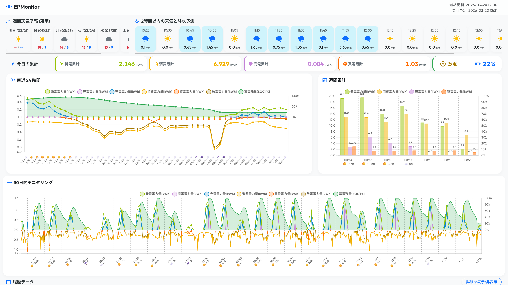
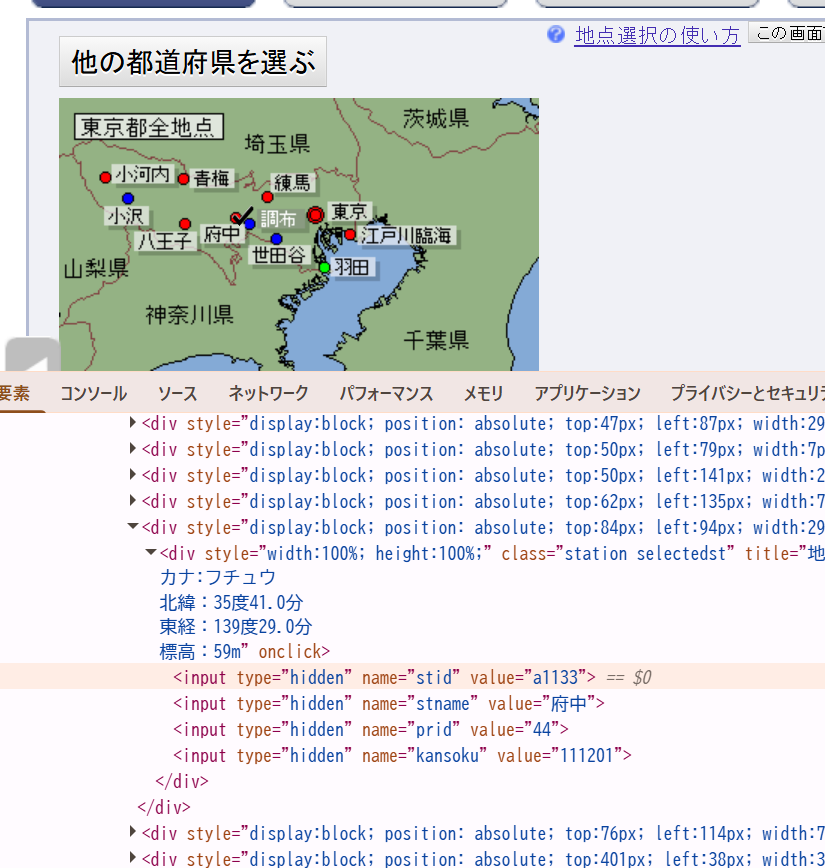
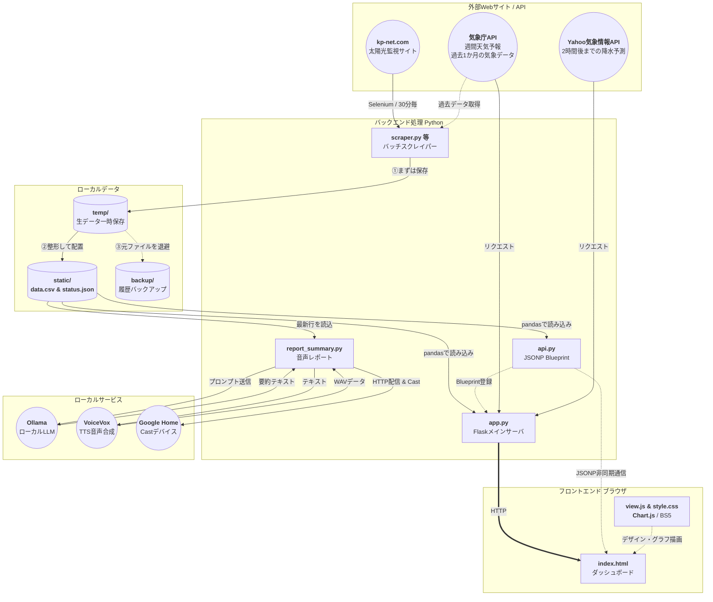

# EPLogger - 太陽光発電モニタリングダッシュボード

オムロンの遠隔モニタリングサービス「KP-Net」から太陽光発電システムの電力データを自動取得し、可視化するWebダッシュボードです。

## 主な機能

- **データ収集:** SeleniumでKP-Netにログインし、CSVデータを自動ダウンロード・マージ（30分間隔でcronを設定すること）
- **リアルタイム可視化:** Chart.js による直近24時間・全期間・週間累計のインタラクティブな電力グラフ（30分単位で自動リロード）
- **蓄電池モニタリング:** 充電/放電ステータスとSOC（残量%）を表示
- **気象情報連携:** 気象庁API（週間天気予報）、Yahoo!天気API（2時間降水予測）を統合表示
- **経済効果分析:** 月次の売電収入・買電支出・導入メリットの集計と可視化
- **音声レポート:** ローカルLLM（Ollama）で最新の発電状況を要約し、VoiceVoxで音声合成してGoogle Home（Castデバイス）で再生


(イメージはPC版。レスポンシブ対応でモバイルアクセスでも閲覧可能。)

## プロジェクト構成

```
EPLogger/
├── scraper.py           # データ取得バッチ（Selenium + CSVマージ）
├── app.py               # Flaskダッシュボードサーバ
├── api.py               # JSONP形式でグラフデータを提供するBlueprint
├── get_past_weather.py  # 気象庁の過去気象データ取得スクリプト
├── report_summary.py    # 音声レポート（LLM要約 → VoiceVox合成 → Cast再生）
├── zundamon.modelfile   # Ollamaカスタムモデル定義（ずんだもんっぽくしゃべってくれるキャラクター定義）
├── .env                 # 環境変数（認証情報・APIキー）
├── .gitignore
├── templates/
│   └── index.html       # ダッシュボードHTMLテンプレート
├── static/
│   ├── view.js          # Chart.js グラフ描画スクリプト
│   ├── style.css        # カスタムCSS
│   ├── data.csv         # 電力データ（動的生成）
│   └── past_weather.csv # 過去気象データ（動的生成）
├── temp/                # ダウンロード一時ファイル
└── backup/              # バックアップファイル
```

## セットアップ方法

### 前提条件

- Python 3.10+
- Google Chrome（Seleniumで使用）

### 1. リポジトリのクローンと仮想環境の構築

```bash
git clone <リポジトリURL>
cd EPLogger
python -m venv .
# Scripts\activate      # Windowsで実施
# source bin/activate  # Linux/Macで実施
```

### 2. 依存パッケージのインストール

```bash
# ダッシュボード本体
pip install flask pandas selenium webdriver-manager python-dotenv requests

# 音声レポート機能（report_summary.py）を使う場合のみ追加
pip install ollama pychromecast
```

> 音声レポートは Ollama（ローカルLLM）・VoiceVox（TTS）・Google Home（Castデバイス）を別途用意する必要があります。詳細は「音声レポートの実行」を参照してください。

### 3. 環境変数の設定

`.env` ファイルをプロジェクトルートに作成し、以下の変数を設定してください：
> ⚠️ `.env` は `.gitignore` に含まれており、Gitにはコミットされません

```env
# KP-Net（遠隔モニタリングサービス）のログイン設定
LOGIN_ID=<KP-NetへのログインID>
LOGIN_PASSWORD=<KP-Netへのログインパスワード>

# Yahoo!気象情報API関連
COORDINATES=<観測地点の経度>,<観測地点の緯度>（例: 139.76719,35.68136）
APP_ID=<Yahoo!のAPIキー>

# 気象庁 週間予報API関連
JMA_AREA_CODE0=<都道府県コード>  # 気象庁 週間予報API用（例: 130000=東京都）
JMA_AREA_CODE1=<天気エリアコード> # 気象庁 天気情報エリア（例: 130010=東京地方(本州)）
JMA_AREA_CODE2=<気温エリアコード> # 気象庁 気温情報エリア（例: 44132=東京）
JMA_STATION_NUM=<観測所番号>     # 気象庁 過去の気象データ用（例: s47662=東京）

# Google Home / Cast デバイス
GOOGLE_HOME_NAME=<Google Homeのデバイス名（Homeアプリで確認）>
PC_IP=<このPCのLAN内IPアドレス>
SERVE_PORT=8765               # WAVファイル配信ポート（競合しなければ変更可）

# VoiceVox
VOICEVOX_URL=http://localhost:50021
SPEAKER_ID=3                  # VoiceVoxの話者ID（3はずんだもん）

# Ollama（zundamon.modelfile から ollama create zundamon で作成）
OLLAMA_MODEL=zundamon         # zundamon.modelfile から作成したカスタムモデル名
OLLAMA_HOST=http://localhost:11434
```

1. `JMA_AREA_CODE0` は 都道府県番号2桁+0000
2. `JMA_AREA_CODE1` は `https://www.jma.go.jp/bosai/forecast/data/forecast/{JMA_AREA_CODE0}.json` にアクセスして `[0].timeSeries[0].areas` を見ると、その地域の観測所が見つかります。  
    たとえば東京だと

    ```json
    [
    {
        "publishingOffice": "気象庁",
        "reportDatetime": "2026-02-28T17:00:00+09:00",
        "timeSeries": [
        {
            "areas": 
            "areas": [
                {
                "area": {
                    "name": "東京地方",
                    "code": "130010"
                },
                //省略
                },
                {
                "area": {
                    "name": "伊豆諸島北部",
                    "code": "130020"
                },
                //省略
                },
                {
                "area": {
                    "name": "伊豆諸島南部",
                    "code": "130030"
                },
                //省略
                },
                {
                "area": {
                    "name": "小笠原諸島",
                    "code": "130040"
                },
                //省略
                }
    ```

    の4か所があるので、その中から最も近い地域の `code` を設定します。
3. `JMA_AREA_CODE2` は 最末尾の `precipAverage` をみると

    ```json
        "precipAverage": {
        "areas": [
            {
            "area": {
                "name": "東京",
                "code": "44132"
            },
            // 省略
            },
            {
            "area": {
                "name": "大島",
                "code": "44172"
            },
            // 省略
            },
            {
            "area": {
                "name": "八丈島",
                "code": "44263"
            },
            // 省略
            },
            {
            "area": {
                "name": "父島",
                "code": "44301"
            },
            // 省略
            }
        ]
        }
    ```

    のようにすんなりわかるので、対応する `code` を設定します。
4. `JMA_STATION_NUM` は少し複雑です。  
    1. 気象庁の「[過去の気象データ・ダウンロード](https://www.data.jma.go.jp/risk/obsdl/index.php)」ページに行きます。
    2. 「地点を選ぶ」で対象の都道府県をクリック
    3. 対象の観測所を**右クリック**して、「検証」
    4. 一個下の要素のhidden項目の中の、`stid` の値が `JMA_STATION_NUM` になります。
    

## 使い方

### データ取得（手動実行）

```bash
# 当月のデータを取得
python scraper.py

# 特定月のデータを取得
python scraper.py 2026-02
```

### ダッシュボードの起動

```bash
python app.py
```

ブラウザで `http://localhost:5000/` にアクセスしてダッシュボードを確認できます。
LAN内の他端末からは `http://<サーバーのIPアドレス>:5000/` でアクセス可能です。

### 定期実行（推奨）

`scraper.py` を **30分おき** に自動実行することで、常に最新の電力データを保持できます。
また、`get_past_weather.py` を **1日1回（0時推奨）** 実行して、日々の過去気象データを自動取得することを推奨します。

#### Linux / Mac（crontab）

```bash
# crontab を編集
crontab -e

# 以下の行を追加（30分おきに scraper.py を実行）
*/30 * * * * cd /path/to/EPLogger && /path/to/EPLogger/bin/python scraper.py >> /path/to/EPLogger/cron.log 2>&1

# 以下の行を追加（1日1回 0時に get_past_weather.py を実行）
0 0 * * * cd /path/to/EPLogger && /path/to/EPLogger/bin/python get_past_weather.py >> /path/to/EPLogger/weather_cron.log 2>&1
```

#### Windows（タスクスケジューラ）

`setup_scheduler.ps1` を **管理者権限** で実行すると以下の3つのタスクが自動登録されます。

```powershell
# PowerShell を「管理者として実行」して実行
cd D:\path\to\EPLogger
Set-ExecutionPolicy -Scope Process -ExecutionPolicy Bypass
.\setup_scheduler.ps1

# 登録確認
Get-ScheduledTask -TaskName 'EPLogger-*' | Format-Table TaskName, State, NextRunTime
```

登録されるタスク:

```
# scraper.py の設定
プログラム: python
引数:       D:\path\to\EPLogger\scraper.py
開始:       D:\path\to\EPLogger
トリガー:   30分ごとに繰り返し

# get_past_weather.py の設定
プログラム: python
引数:       D:\path\to\EPLogger\get_past_weather.py
開始:       D:\path\to\EPLogger
トリガー:   毎日 0:00

# report_summary.py の設定
プログラム: python
引数:       D:\path\to\EPLogger\report_summary.py
開始:       D:\path\to\EPLogger
トリガー:   毎日 7:00, 12:00, 17:00 （任意の時間に設定してあげてください）
```

### 過去気象データの取得

```bash
python get_past_weather.py
```

### 音声レポートの実行

最新の発電状況を音声でGoogle Homeに通知します。

```bash
python report_summary.py
```

#### 処理の流れ

1. `static/data.csv` の末尾行（最新の30分データ）を読み込む
2. 発電・消費・SOCなどをプロンプトに整形し、OllamaのローカルLLMに送信
3. LLMが生成したテキスト（30字以内の発電状況サマリ）をVoiceVoxで音声合成してWAVファイルを生成
4. ローカルのFlaskサーバで一時的にWAVファイルを配信し、Google Home（Castデバイス）で再生

#### 前提環境

| コンポーネント | 役割 | 備考 |
|:---|:---|:---|
| [Ollama](https://ollama.com/) | ローカルLLM実行環境 | `.env` の `OLLAMA_MODEL` でモデル名を指定 |
| ずんだもんモデル（`zundamon`） | キャラクター口調での要約 | `zundamon.modelfile` から作成する（下記参照） |
| [VoiceVox](https://voicevox.hiroshiba.jp/) | テキスト音声合成（TTS） | ローカルで起動しておく（デフォルト: `localhost:50021`） |
| Google Home / Castデバイス | 音声再生 | PCと同一LAN上に配置する |

#### VoiceVoxの起動

VoiceVox エンジンを Docker で起動します。CPU 版で十分です。

```powershell
docker run -d --name voicevox -p 50021:50021 --restart always voicevox/voicevox_engine:cpu-latest
```

オプションの意味：

- `-d` : バックグラウンド実行
- `--name voicevox` : コンテナ名
- `-p 50021:50021` : ポート公開（ホスト側 50021 → コンテナ側 50021）
- `--restart always` : PC 再起動後も自動起動
- `voicevox/voicevox_engine:cpu-latest` : CPU 版イメージ（数GB、初回 DL に時間がかかります）

> Docker Desktop（Windows / Mac）または Docker Engine（Linux）のインストールが前提です。

#### 動作確認

```powershell
# バージョン確認（PowerShell）
Invoke-RestMethod http://localhost:50021/version

# 起動中コンテナ確認
docker ps
```

バージョン文字列が返れば起動成功です。

#### 運用コマンド

```powershell
# 停止
docker stop voicevox

# 起動（停止後の再開）
docker start voicevox

# ログ確認
docker logs voicevox --tail 50

# 削除（再構築したい時のみ）
docker stop voicevox
docker rm voicevox
```

#### 話者IDの確認

`.env` の `SPEAKER_ID` で話者・スタイルを指定します。ずんだもんの主な話者IDは以下です。

| SPEAKER_ID | スタイル |
| ---------- | ------------------ |
| 1          | ずんだもん（あまあま）   |
| 3          | ずんだもん（ノーマル） |
| 5          | ずんだもん（ツンツン）   |
| 7          | ずんだもん（セクシー）   |
| 22         | ずんだもん（ささやき） |
| 38         | ずんだもん（ヒソヒソ） |

ずんだもん以外の話者を使いたい場合は、以下のコマンドで利用可能な全話者の一覧を取得できます。

```powershell
Invoke-RestMethod http://localhost:50021/speakers | ConvertTo-Json -Depth 5
```

#### カスタムモデルの作成（ずんだもん）

ベースモデル（`gemma3:4b`）を取得し、カスタムモデルをビルドします。

```bash
# ベースモデルを取得（初回のみ・数GB）
ollama pull gemma3:4b

# ずんだもんモデルを作成
ollama create zundamon -f zundamon.modelfile
```

作成したモデルは以下で動作確認できます。

```bash
ollama run zundamon "今の発電状況をまとめて"
```

> キャラクター設定（一人称・語尾・口調）はすべて `zundamon.modelfile` の `SYSTEM` ブロックに記述されており、`report_summary.py` 側には口調を固定するコードはありません。モデルをビルドし直すだけで口調変更できます。

必要な環境変数はすべて「[3. 環境変数の設定](#3-環境変数の設定)」にまとめています。

## アーキテクチャ


```mermaid
graph TD
    subgraph Web[外部Webサイト / API]
        KPNet((<strong>kp-net.com</strong><br>太陽光監視サイト))
        JMA((<strong>気象庁API</strong><br>週間天気予報<br>過去1か月の気象データ))
        Yahoo((<strong>Yahoo気象情報API</strong><br>2時間後までの降水予測))
    end

    subgraph Backend[バックエンド処理 Python]
        Scraper[<strong>scraper.py 等</strong><br>バッチスクレイパー]
        App[<strong>app.py</strong><br>Flaskメインサーバ]
        API[<strong>api.py</strong><br>JSONP Blueprint]
        Report[<strong>report_summary.py</strong><br>音声レポート]
    end

    subgraph Storage[ローカルデータ]
        Temp[(<strong>temp/</strong><br>生データ一時保存)]
        Data[(<strong>static/<br>data.csv & status.json</strong>)]
        Backup[(<strong>backup/</strong><br>履歴バックアップ)]
    end

    subgraph Frontend[フロントエンド ブラウザ]
        HTML[<strong>index.html</strong><br>ダッシュボード]
        Assets[<strong>view.js & style.css<br>Chart.js</strong> / BS5]
    end

    subgraph VoiceLocal[ローカルサービス]
        Ollama((<strong>Ollama</strong><br>ローカルLLM))
        VoiceVox((<strong>VoiceVox</strong><br>TTS音声合成))
        GoogleHome((<strong>Google Home</strong><br>Castデバイス))
    end

    %% スクレイピングとファイル処理のフロー
    KPNet -->|Selenium / 30分毎| Scraper
    JMA -.->|過去データ取得| Scraper

    Scraper -->|①まずは保存| Temp
    Temp -->|②整形して配置| Data
    Temp -.->|③元ファイルを退避| Backup

    %% バックエンドのフロー
    Data -->|pandasで読み込み| API
    Data -->|pandasで読み込み| App
    API -.->|Blueprint登録| App

    %% 天気APIのフロー
    JMA -->|リクエスト| App
    Yahoo -->|リクエスト| App

    %% 画面表示のフロー
    App ===>|HTTP| HTML
    API -.->|JSONP非同期通信| HTML
    Assets -.->|デザイン・グラフ描画| HTML

    %% 音声レポートのフロー
    Data -->|最新行を読込| Report
    Report -->|プロンプト送信| Ollama
    Ollama -->|要約テキスト| Report
    Report -->|テキスト| VoiceVox
    VoiceVox -->|WAVデータ| Report
    Report -->|HTTP配信 & Cast| GoogleHome
```

## ダッシュボード表示内容

| セクション | 内容 |
| :--- | :--- |
| 週間天気予報 | 気象庁API から取得した7日間の天気・気温 |
| 降水予測 | Yahoo!天気API から取得した直近2時間の10分間隔降水量 |
| 本日累計 | 発電・消費・売電・買電の当日累計kWh |
| バッテリー | 充電/放電アイコン + SOC残量% |
| 直近24時間グラフ | 発電・消費・売電・買電・充電・放電 + SOC折れ線 |
| 30日間 / 全件モニタリング（タブ切替） | 期間別のトレンドグラフ（日付変更線付き） |
| 週間累計グラフ | 日ごとの累計棒グラフ |
| 経済効果・蓄電池運用の分析 | 月次売電収入・買電支出・導入メリット、時間帯別充放電・SOC平均 |

## 技術スタック

- **バックエンド:** Python, Flask, pandas
- **スクレイピング:** Selenium, webdriver-manager
- **フロントエンド:** Chart.js, Bootstrap 5, Bootstrap Icons
- **気象データ:** 気象庁ボサイAPI, Yahoo!天気API
- **音声レポート:** Ollama（ローカルLLM）, VoiceVox（TTS）, pychromecast（Google Home再生）
- **環境管理:** python-dotenv

## OSS Licenses

本プロジェクトが直接依存するパッケージとそのライセンス一覧です。

### Python Dependencies

| パッケージ | ライセンス | 用途 |
| :--- | :--- | :--- |
| Flask | BSD-3-Clause | Webサーバ |
| pandas | BSD-3-Clause | データ処理 |
| python-dotenv | BSD-3-Clause | 環境変数管理 |
| requests | Apache-2.0 | HTTP通信 |
| selenium | Apache-2.0 | スクレイピング |
| webdriver-manager | MIT | ChromeDriver管理 |
| ollama | MIT | ローカルLLM（音声レポート） |
| pychromecast | MIT | Google Home再生（音声レポート） |

### Frontend Dependencies

| パッケージ | ライセンス |
| :--- | :--- |
| Bootstrap 5 | MIT |
| Bootstrap Icons | MIT |
| Chart.js | MIT |

## Licenses

本プロジェクトは [MIT License](./LICENSE.md) のもとで公開されています。  
ただし、スクレイパーによる自動取得処理および個人用途を想定したYahoo! APIを含むため、個人利用目的以外での利用はご遠慮ください。

Copyright (c) 2026 ayeci
